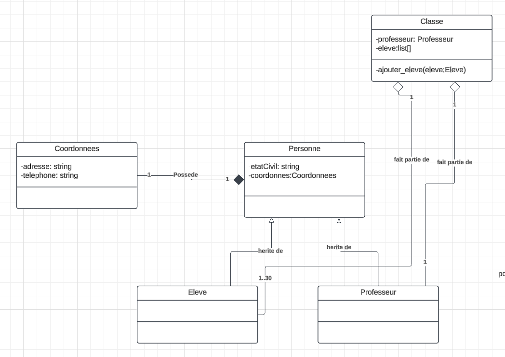

[lien lucidChart-UML](https://lucid.app/lucidchart/3985bc92-c516-48af-a028-01b02398eb7f/edit?viewport_loc=-2880%2C-1207%2C2560%2C1276%2C0_0&invitationId=inv_56667d76-bcca-4660-b00d-c8202266a86d)

#Class animal:

Chaque animal possède exactement 1 tête et 1 corps (composition).
Il peut avoir plusieurs membres. Les membres appartiennent à un seul animal.
Habitat :

Chaque animal peut avoir 1 habitat.
Un habitat peut être partagé par 0 à n animaux (agrégation).
Héritage :

Les espèces (comme Lapin, Mouton) sont des sous-classes de la classe mère Animal.

#Class classe:

Les classes Élève et Professeur héritent de la classe mère Personne, qui centralise les informations communes.  

Chaque Classe possède un professeur et entre 1 et 30 élèves. Ces éléments sont gérés directement dans la classe Classe.  

Les Coordonnees (adresse et téléphone) sont uniques à chaque personne et ne peuvent pas exister indépendamment d’elle.
Cette relation est une composition entre Personne et Coordonnees.

La classe Email représente un message composé d’un titre et d’un texte, tous deux optionnels.
Elle contient également les informations obligatoires de l'expéditeur et du destinataire.

Un Email peut comporter une liste de fichiers joints.
Chaque fichier joint est représenté par la classe FichierJoint, qui contient un nom, une taille et un chemin d’accès.

La relation entre Email et FichierJoint est une composition : un email peut posséder de zéro à plusieurs fichiers joints, qui dépendent directement de l'email.